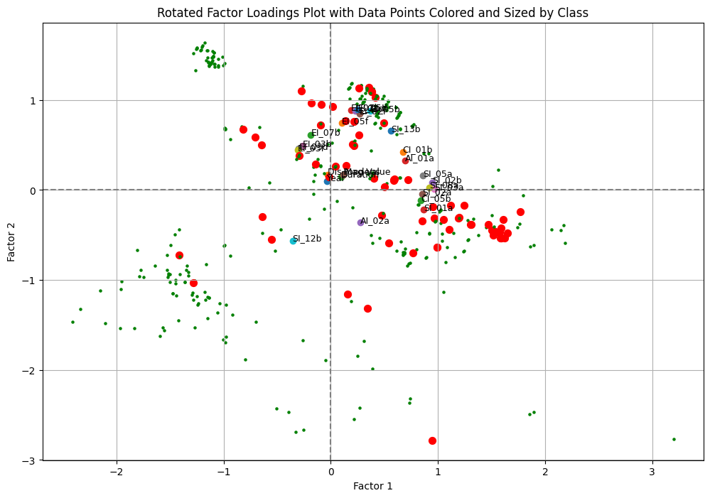
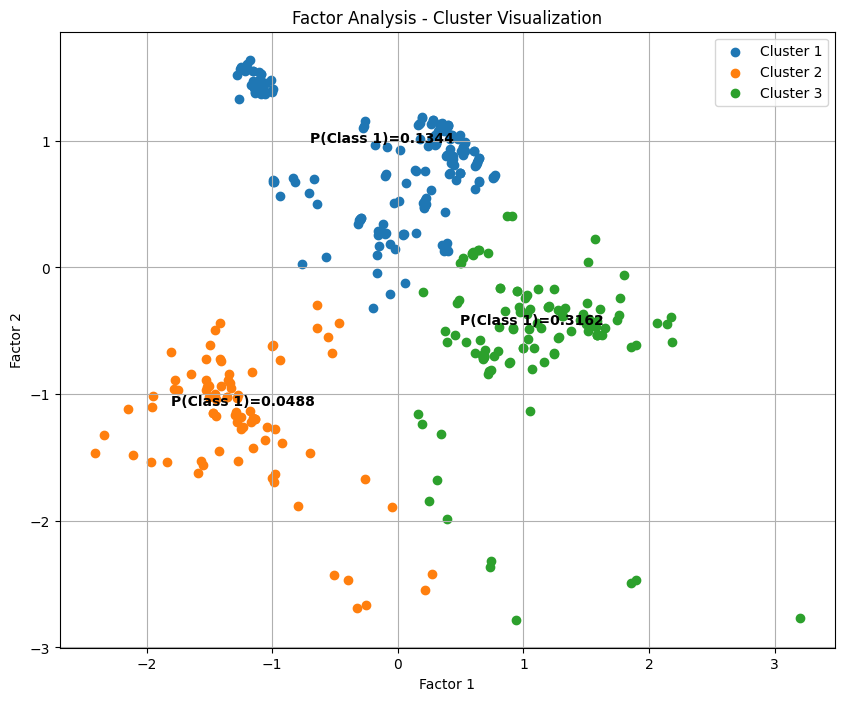
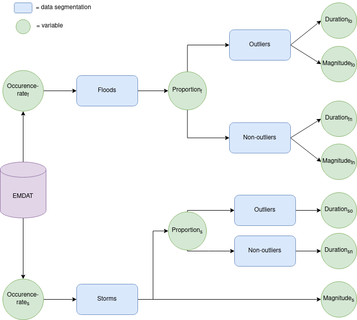

# Intro

Among the highlighted consequences of human-driven climate change, the UN predicts that an increasing frequency and severity of several natural disasters will disproportionately affect disenfranchised and rural communities leading to a surge in displacements of people on a global scale [[1]](#1)[[2]](#2). We start to see this unfold in publicly available data, the *Internal Displacement Monitoring Center* has been tracking internal displacements since 2008. In this timeframe the anually disaplaced people due to natural disasters has averaged around 25 million [[3]](#3).

This project is aimed at creating a simulation model which attempts to predict the number of internal displacement caused by natural disasters under the 5 Shared Socioeconomic Pathways (SSPs) as outlined by the UN [[4]](#4).

In this repository there are 5 code files:
- GIVE_scenarios.jl - julia code for running MimiGIVE simulations by Rennert et. al [[8]](#8) to get the scenario global and country parameters from MimiSSPs [[7]](#7).
- data_exploration.ipynb - Descriptive data analysis of EMDAT and WRI
- parameter_estimation.ipynb - Estimating and saving distributional and model parameters used in the simulation
- model.ipynb - The simulation model. Can be run for all simulations and will save the output.
- results.ipynb - Analysis of the saved results from the model.

# Data
- EMDAT [[5]](#5)
Public dataset of natural disasters including durations, magnitudes, location and effects, inventoried since 1988.
- WRI [[6]](#6)
World Risk Index - evaluating the exposure and vulnerability of countries since 2000, based on various socioeconomic indicators and gridded population data.
- MimiSSPs [[7]](#7)
Part of the larger work by Rennert et. al [[8]](#8) in determining the social cost of carbon.

Descriptive data analysis can be seen in **data_exploration.ipynb**

# Parameterization

All the final parameterizations can be found in **parameter_estimation.ipynb**

## Chance of causing Displacement
To determine the chance of a disaster causing displacement, we will use the WRI information on countries in the given year that a disaster strikes, the magnitude and duration of the disaster and the population density 
A Principal Component Analysis of the WRI dataset reveals the first component to be representing most of the socioeconomic indicators and the secondth principal component to consists of the different measures of exposure. Based on this information, we remove some highly correlated variables and run a determine an underlying factor model via. Factor Analysis. 

Then we use a k-means clustering to segment the data into three clusters, and we find the proportion of disasters in each clusters that caused displacement.

We do this procedure for both storms and floods, as can be seen in *data_exploration.ipynb*

## Disaster Magnitudes and Durations
The findings in *data_exploration.ipynb* and initial testing showed that fitting a single distribution to anything but storm magnitudes was infeasible. So the data has been segmented into floods and storms and into outliers and non-outliers, classifying any measurements that is 1.5 the interquartile range above the third quartile as outliers. The segmentation can be seen below:

The variables are investigated for trends, as can be seen in *data_exploration.ipynb* and the variables **Occurence-ratef**, **Occurence-rates**, **Magnitudefo**, **Magnitudefn**, and **Durationso** where found to be trending upwards and correlated with the global temperature increase. The rest were seen to be stationary and appropriate distributions were fitted either by region or by country.

Every distribution has their own parameters, they are not shared across distributions, but the subscripts and indicies have been dropped in the notation below for clarity.

### Stationary Parameters
For the stationary parameters it is assumed that they are static and have been inferred with MLE estimators
- Proportionf ~ Beta($\alpha, \beta$) for every region
- Proportions ~ Beta($\alpha, \beta$) for every region
- Durationfo ~ Weibull($\kappa, \lambda, \theta$) for every region
- Durationfn ~ Gamma($\alpha, \beta, \theta$) for every region
- Durationsn ~ Gamma($\alpha, \beta, \theta$) for every region
- Magnitudes ~ N($\mu,\sigma$) for every region

### Trending Parameters
For the trending parameters, it is assumed that they are a function of T, the global average temperature relative to 1900, and the parameters has been inferred with Bayesian hierarchical models.
- Occurence-ratef ~ Poisson($\exp(\alpha + \beta T)$) for every country
- Occurence-rates ~ Poisson($\exp(\alpha + \beta T)$) for every country
- Magnitudefo ~ Weibull($\kappa, \exp(\lambda \times T)$) for every region
- Magnitudefn ~ Weibull($\kappa, \exp ( \lambda T ) $) for every region
- Durationso ~ Weibull($\kappa, \lambda  T$) for every region

## Disaster Displacement Magnitude
A linear regression model has been trained on all disasters in EMDAT that causes displacement, to predict the percentage of the population that a disaster displaces $0 \leq X \leq 1$, given that we know it will cause displacement. The model is given *Disaster Magnitude*, *Duration* and *Population Density* as predictor variables.

$$X = \beta_0 + \beta_1\text{Magnitude} + \beta_2\text{Duration} + \beta_3\text{Popdens}$$

# Model

Putting everything together in our simulation model, as can be found in **model.ipynb**
1. Load scenario global parameters (T, Year)
2. Load scenario country parameters (GDP, Population, size, wri)
3. For every year:
    1. Update Global Temperature and advance year
    2. For every country:
        1. Update Population and GDP
        2. Calculate occurence-ratef ($\lambda_f$) = $\alpha + \beta * T$
        3. Draw flood outlier percentage ($\pi_f$) ~ Beta($\alpha, \beta$)
        4. Draw number of floods ~ Poisson($\lambda_f$)
        5. For every flood:
            1. Draw outlier status ~ Bernoulli($\pi_f$)
            2. If outlier = 1:
                1. Draw magnitude ~ Weibull($\kappa, \exp(\lambda * T)$)
                2. Draw duration ~ Weibull($\kappa, \lambda, \theta$)
            3. If outlier = 0:
                1. Draw magnitude ~ Weibull($\kappa, \exp(\lambda * T)$)
                2. Draw duration  ~ Gamma($\alpha, \beta, \theta$)
            4. Calculate factors = f(wri, duration, magnitude)
            5. Predict clusters = f(factors)
            6. Draw displacement status ~ Bernoulli(Cluster probability)
            7. if Displacement = 1:
                1. Displacement ~ N($(\beta_0 + \beta_1\text{Magnitude} + \beta_2\text{Duration} + \beta_3\text{Popdens}), 0.0001$)
                2. idp = idp + Displacement
                3. Population = Population - Displacement
                4. Update population density
        6. Calculate occurence-rates ($\lambda_s$) = $\alpha + \beta * T$
        7. Draw storm outlier percentage ($\pi_s$) ~ Beta($\alpha, \beta$)
        8. Draw number of storms ~ Poisson($\lambda_s$)
        9. For every storm:
            1. Draw outlier status ~ Bernoulli($\pi_s$)
            2. If outlier = 1:
                1. Draw duration ~ Weibull($\kappa, \exp(\lambda * T)$)
            3. If outlier = 0:
                1. Draw duration  ~ Gamma($\alpha, \beta, \theta$)
            4. Draw magnitude ~N($\mu, \sigma$)
            5. Calculate factors = f(wri, duration, magnitude)
            6. Predict clusters = f(factors)
            7. Draw displacement status ~ Bernoulli(Cluster probability)
            8. if Displacement = 1:
                1. Displacement ~ N($(\beta_0 + \beta_1\text{Magnitude} + \beta_2\text{Duration} + \beta_3\text{Popdens}), 0.0001$)
                2. idp = idp + Displacement
                3. Population = Population - Displacement
                4. Update population density

# Results

# Discussion

# Conclusion

## References
<a id="1">[1]</a> 
U. Nations, 
‘Causes and Effects of Climate Change’, United Nations. 
Accessed: Dec. 23, 2023. [Online]. 
Available: https://www.un.org/en/climatechange/science/causes-effects-climate-change

<a id="2">[2]</a> 
Ian Fry,
‘“Intolerable tide” of people displaced by climate change: UN expert’, OHCHR. 
Accessed: Dec. 23, 2023. [Online]. 
Available: https://www.ohchr.org/en/press-releases/2022/06/intolerable-tide-people-displaced-climate-change-un-expert

<a id="3">[3]</a> 
‘Global Internal Displacement Database’, 
IDMC - Internal Displacement Monitoring Centre. 
Accessed: Dec. 23, 2023. [Online]. 
Available: https://www.internal-displacement.org/database/displacement-data

<a id="4">[4]</a> 
K. Riahi, D. P. van Vuuren, E. Kriegler, and B. O’Neill,
‘The Shared Socio‐Economic Pathways (SSPs): An Overview’, [Online]. 
Available: https://unfccc.int/sites/default/files/part1_iiasa_rogelj_ssp_poster.pdf

<a id="5">[5]</a> 
‘EM-DAT - The international disaster database’. 
Accessed: Dec. 23, 2023. [Online]. 
Available: https://www.emdat.be/

<a id="6">[6]</a> 
‘WeltRisikoBericht’, 
WeltRisikoBericht. 
Accessed: Dec. 23, 2023. [Online]. 
Available: https://weltrisikobericht.de/en/

<a id="7">[7]</a> 
‘anthofflab/MimiSSPs.jl’. 
The Society, Environment and Economics Lab,
Feb. 09, 2023. 
Accessed: Dec. 23, 2023. [Online]. 
Available: https://github.com/anthofflab/MimiSSPs.jl

<a id="8">[8]</a> 
K. Rennert et al.,
‘Comprehensive evidence implies a higher social cost of CO2’, 
Nature, vol. 610, no. 7933, pp. 687–692, 
Oct. 2022, 
doi: 10.1038/s41586-022-05224-9.

